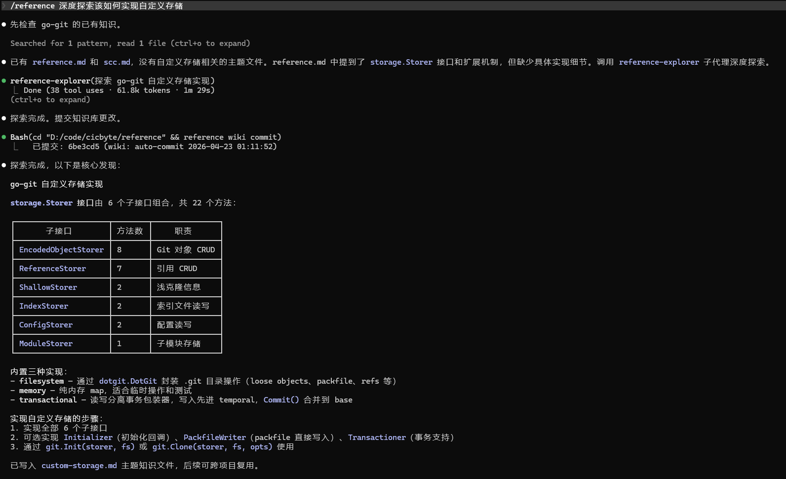
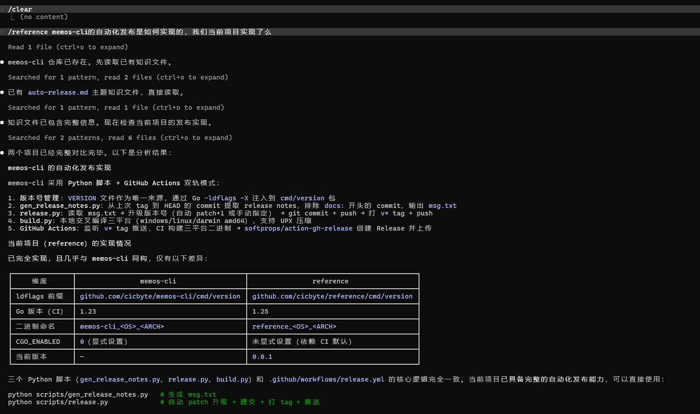
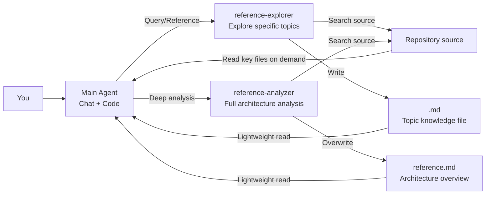

# reference

English | [简体中文](README.md)

> One command to link any Git repository's source code and knowledge into your current project, giving AI instant access.


**Add repositories** — Link remote or local Git repositories to your project with a single command, automatically generating code statistics and architectural knowledge.


**Explore knowledge** — AI sub-agents automatically read source code and distill exploration results into Markdown knowledge files. Explore once, reuse across projects.



**Knowledge reuse** — Exploration results are saved as global knowledge files. When you add the same repository to a new project, existing knowledge is immediately available — no need to re-explore.



## Features

- **Zero-latency access** — Source code lives on your local disk. AI reads it directly via Grep/Glob/Read with no network requests.
- **Reusable knowledge** — Exploration results are saved as Markdown knowledge files. One exploration benefits all projects.
- **Clean context** — Dual-agent architecture: exploration happens in sub-agents, the main Agent only loads lightweight knowledge files.
- **Multi-AI compatible** — Full support for Claude Code; works with Cursor, Copilot, Windsurf, and more.
- **Fully local** — No online APIs or paid services required. Works offline, unaffected by network issues.
- **Local repository references** — Reuse code you've implemented in other projects.

## Installation

```bash
# Build from source
git clone https://github.com/cicbyte/reference.git
cd reference
go build -o reference .

# Or download pre-built binaries (Windows/Linux/macOS) from Release
# https://github.com/cicbyte/reference/releases
```

Requires Go 1.24+.

## Quick Start

### 1. Initialize

```bash
reference          # First run: interactive assistant selection
```

```
  Welcome to reference!

  Select your coding assistant:
    [1] Claude Code
    [2] None (repository management only)

  Enter option (1/2): 1
  Configured: Claude Code
  Linked 0 repositories.
```

### 2. Add Repositories

```bash
# Remote repositories (supports owner/repo shorthand)
reference repo add gin-gonic/gin
reference repo add go-git/go-git

# Local repositories
reference repo add --local ~/projects/my-lib
```

After adding, `.reference/` dynamically loads source code and knowledge via Junction links:

```
<project>/
├── .reference/
│   ├── repos/                  # Repository source code (→ global cache)
│   │   ├── gin/
│   │   └── go-git/
│   ├── wiki/                   # Knowledge base (→ global wiki)
│   │   ├── gin/
│   │   └── go-git/
│   ├── reference.map.jsonl    # AI navigation data (JSONL format)
│   └── reference.settings.json # Project settings
```

No copying, no wasted space. Global cache is shared across projects — add once, use everywhere.

### 3. Collaborate with AI

After adding repositories, just start chatting. AI automatically consults local knowledge.

> **You**: How does go-git's clone work internally?
>
> **AI**: Let me check existing knowledge... I've written a topic knowledge file about the clone flow. It's now available for reuse across projects.

## Core Design: Dual-Agent Architecture

Solving a fundamental tension — **the main Agent needs to read large amounts of source code, but code must not pollute the conversation context**.



- **reference-explorer** — Explores specific questions ("How is X implemented?"), outputs topic knowledge files. Checks existing knowledge first — if found, reuses it directly; otherwise dives into source code. Exploration results are written to the knowledge directory for cross-project reuse.
- **reference-analyzer** — Performs comprehensive architecture analysis, outputs `reference.md` (only needs to run once globally). Covers layered architecture, core data structures, key workflows (with Mermaid diagrams), design decisions, and more.
- **Main Agent** loads knowledge files first for a quick overview, then reads key source files on demand only when necessary.

### Knowledge File Structure

Each repository's knowledge directory contains the following files:

```
<wiki>/<repo-name>/
├── reference.md        # Architecture overview (generated by analyzer, once globally)
└── <topic>.md           # Topic knowledge files (generated on-demand by explorer)
```

Code statistics are obtained in real-time via `reference repo scc <name>` — no static files generated.

All files are pure Markdown + Mermaid. Generated once, reused across projects.

## Platform Support

| Platform | Features |
|:---|:---|
| **Claude Code** | Full features: dual-agent + Skill + automatic knowledge injection |
| **Cursor / Copilot / Windsurf** | Add repositories, then guide AI to check the `.reference/` directory |
| **No AI** | Repository management, code statistics, knowledge base management |

Knowledge files are pure Markdown — any AI can read them directly.

## Usage

### Repository Management

```bash
reference repo add <url>              # Add remote repository
reference repo add --local <path>     # Add local repository
reference repo remove <name>          # Remove reference
reference repo remove --all           # Remove all references
reference repo list                   # List all references
reference repo update [name]          # Update remote repository
reference repo scc [name] [-n 15]    # Code statistics (language distribution, complexity, top files)
```

All commands that support `--format` can output structured data via `-f json` or `-f jsonl`.

### Knowledge Base Management

```bash
reference wiki                        # View wiki status
reference wiki commit                 # Commit knowledge base changes
reference wiki sync                   # Sync knowledge base (pull + commit + push)
reference wiki remote [url]           # View/set remote repository
reference wiki trash                  # View deleted knowledge files
reference wiki restore <path>         # Restore file from Git history
```

### Global Management

```bash
reference global list               # List all projects and their references
reference global stats              # View global statistics
reference global gc                 # Clean up stale DB records (orphaned project directories)
reference global gc --cache         # Also clean up unreferenced cache directories
reference global gc --dry-run       # Preview cleanable items without deleting
```

### Diagnostics & Configuration

```bash
reference doctor                      # Diagnose and fix reference health
reference proxy set <url|port>        # Set proxy
reference proxy info                  # View proxy settings
reference proxy clear                 # Clear proxy
```

See the [docs/](docs/) directory for detailed documentation.

## Configuration

Configuration file located at `~/.cicbyte/reference/config/config.yaml`:

```yaml
network:
  proxy: http://127.0.0.1:7890
  git_proxy: socks5://127.0.0.1:1080
```

## License

[MIT](LICENSE)
