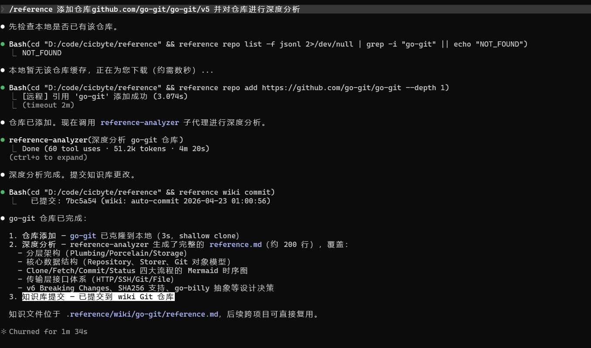
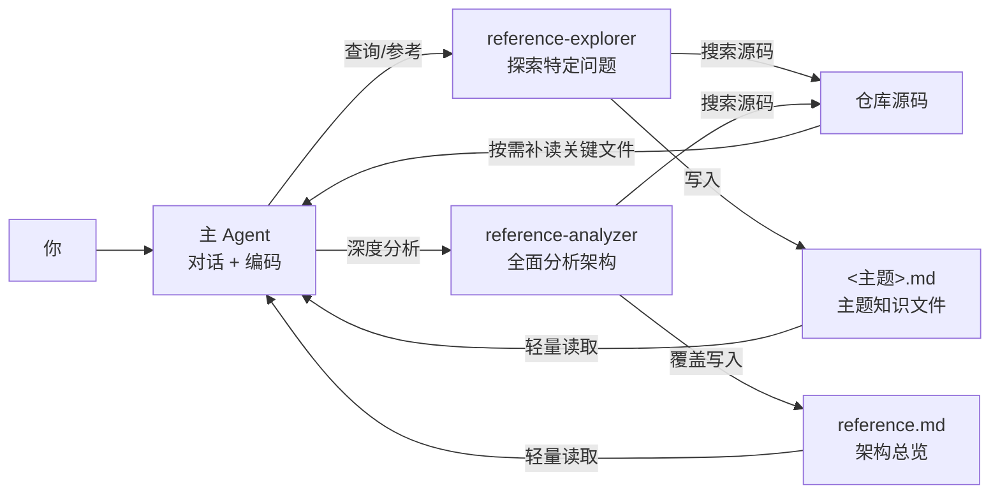

# reference

> 一个命令，把任意 Git 仓库的源码和知识链接到当前项目中，让 AI 即时查阅。




## 功能特性

- **零延迟查阅** — 源码在本地磁盘，AI 直接 Grep/Glob/Read，无网络请求
- **知识可复用** — 探索结果沉淀为 Markdown 知识文件，一次探索，所有项目受益
- **不污染上下文** — 双子代理架构：探索在子代理中完成，主 Agent 只加载知识文件
- **多 AI 助手兼容** — 支持 Claude Code（完整功能）、Cursor、Copilot、Windsurf 等
- **纯本地** — 不依赖任何在线 API 或付费服务，不受网络波动影响
- **本地仓库引用** — 复用你之前在其他项目中实现过的代码

## 安装

```bash
# 从源码构建
git clone https://github.com/cicbyte/reference.git
cd reference
go build -o reference .

# 或从 Release 下载预编译二进制（Windows/Linux/macOS）
# https://github.com/cicbyte/reference/releases
```

要求 Go 1.24+。

## 快速开始

### 1. 初始化

```bash
reference          # 首次运行：交互式选择编程助手
```

```
  欢迎使用 reference！

  请选择你的编程助手：
    [1] Claude Code
    [2] 无（仅使用仓库引用管理功能）

  请输入选项 (1/2): 1
  已配置: Claude Code
  已链接 0 个仓库知识。
```

### 2. 添加仓库

```bash
# 远程仓库（支持 owner/repo 简写）
reference repo add gin-gonic/gin
reference repo add go-git/go-git

# 本地仓库
reference repo add --local ~/projects/my-lib
```

添加后，`.reference/` 下通过 Junction 链接动态加载源码和知识：

```
<project>/
├── .reference/
│   ├── repos/                  # 仓库源码（→ 全局缓存）
│   │   ├── gin/
│   │   └── go-git/
│   ├── wiki/                   # 知识库（→ 全局 wiki）
│   │   ├── gin/
│   │   └── go-git/
│   ├── reference.map.json      # AI 读取的仓库导航
│   └── reference.settings.json # 项目配置
```

不复制、不占空间，全局缓存多项目共享，一处添加，处处可用。

### 3. 与 AI 协作

添加仓库后直接对话，AI 自动查阅本地知识。

> **你**：go-git 的 clone 内部流程是怎样的
>
> **AI**：让我先检查已有知识... 已写入 `克隆流程.md` 主题知识文件，后续可跨项目复用。

## 核心设计：双子代理

解决一个核心矛盾——**主 Agent 需要阅读大量源码，但不能让代码污染对话上下文**。



- **reference-explorer** — 探索特定问题（"X 是怎么实现的"），输出主题知识文件。先检查已有知识，命中则直接复用，未命中才深入源码，探索结果写入知识目录供后续跨项目复用
- **reference-analyzer** — 全面分析架构，输出 `reference.md`（全局只需执行一次）。覆盖分层架构、核心数据结构、关键流程（含 Mermaid 图）、设计决策等
- **主 Agent** 先加载知识文件快速理解全貌，仅在需要时按需读取少量关键源码

### 知识文件结构

每个仓库的知识目录下自动生成以下文件：

```
<wiki>/<仓库名>/
├── reference.md        # 架构总览（analyzer 生成，全局一次）
├── scc.md              # 代码统计（CLI 自动生成）
└── <主题>.md           # 主题知识文件（explorer 按需生成）
```

所有文件为纯 Markdown + Mermaid，一次生成，跨项目复用。

## 平台支持

| 平台 | 功能 |
|:---|:---|
| **Claude Code** | 完整功能：双子代理 + Skill + 知识自动注入 |
| **Cursor / Copilot / Windsurf 等** | 添加仓库后引导 AI 查看 `.reference/` 目录即可 |
| **无 AI** | 仓库管理、代码统计、知识库管理 |

知识文件为纯 Markdown，任何 AI 都能直接读取。

## 使用方法

### 仓库管理

```bash
reference repo add <url>              # 添加远程仓库
reference repo add --local <path>     # 添加本地仓库
reference repo remove <name>          # 移除引用
reference repo remove --all           # 移除全部引用
reference repo list                   # 列出所有引用
reference repo update [name]          # 更新远程仓库
reference repo scc [name]             # 代码统计（语言分布、复杂度）
reference repo scc [name] --top       # Top 文件排名
```

所有支持 `--format` 标志的命令均可使用 `-f json` 或 `-f jsonl` 输出结构化数据。

### 知识库管理

```bash
reference wiki                        # 查看 wiki 状态
reference wiki commit                 # 提交知识库更改
reference wiki sync                   # 同步知识库（pull + commit + push）
reference wiki remote [url]           # 查看/设置远程仓库
reference wiki watch                  # 监听文件变化自动提交
reference wiki watch --daemon         # 后台守护进程模式
reference wiki trash                  # 查看被删除的知识文件
reference wiki restore <path>         # 从 Git 历史恢复文件
```

### 诊断与配置

```bash
reference doctor                      # 诊断并修复引用健康状态
reference proxy set <url|port>        # 设置代理
reference proxy info                  # 查看代理
reference proxy clear                 # 清除代理
```

详细用法见 [docs/](docs/) 目录。

## 配置

配置文件位于 `~/.cicbyte/reference/config/config.yaml`：

```yaml
network:
  proxy: http://127.0.0.1:7890
  git_proxy: socks5://127.0.0.1:1080
```

## 开源许可证

[MIT](LICENSE)
