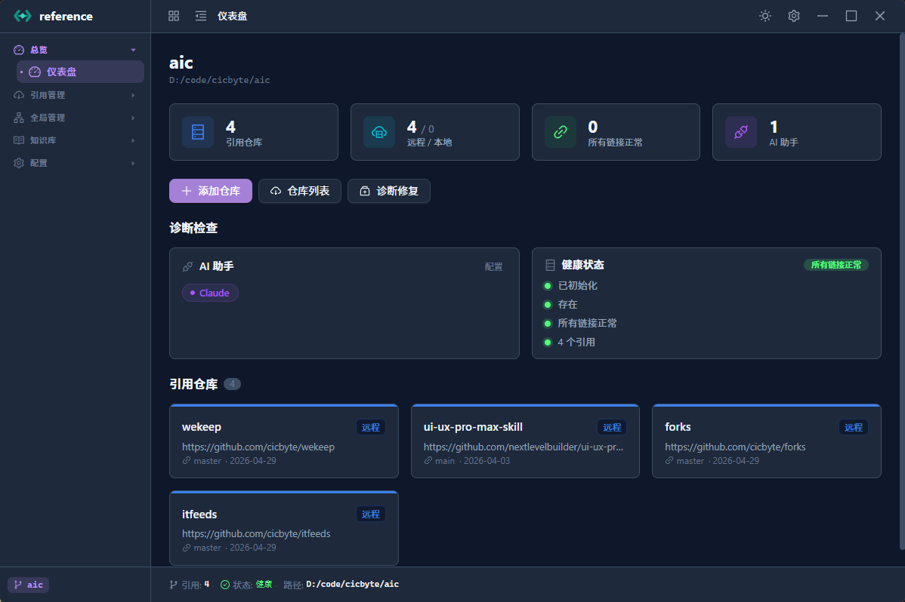
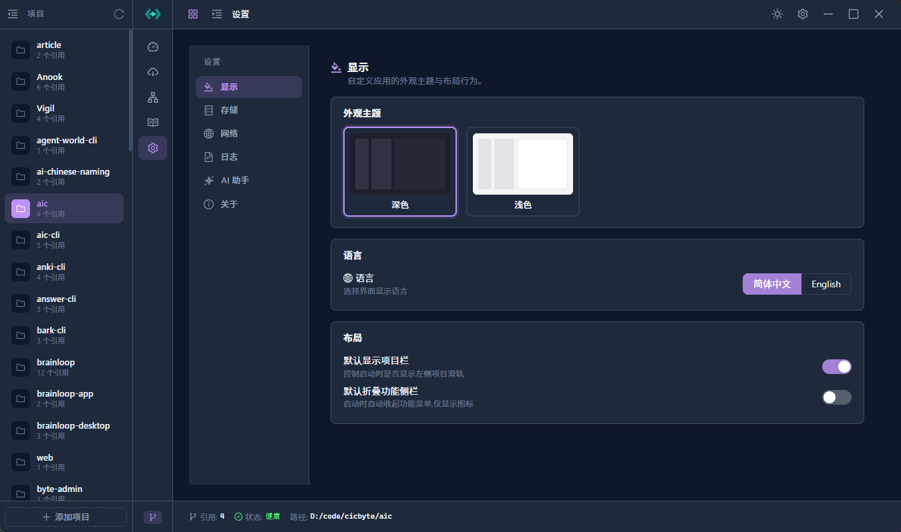
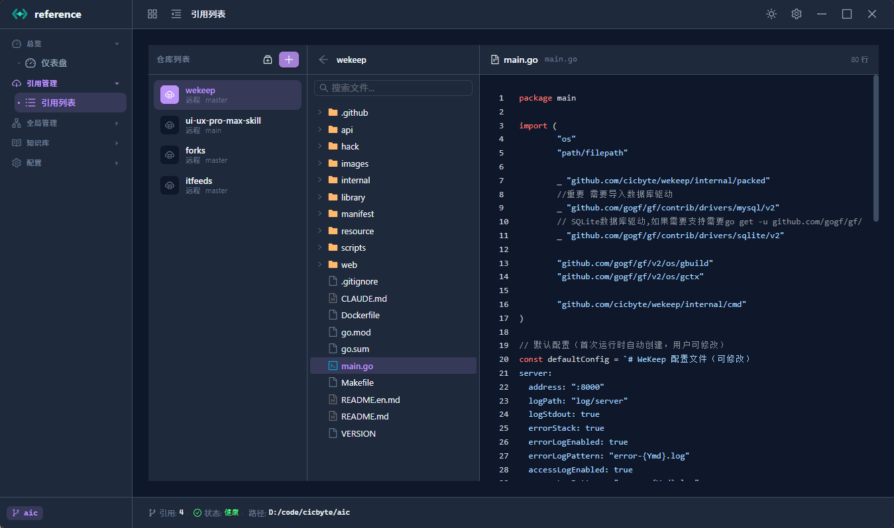
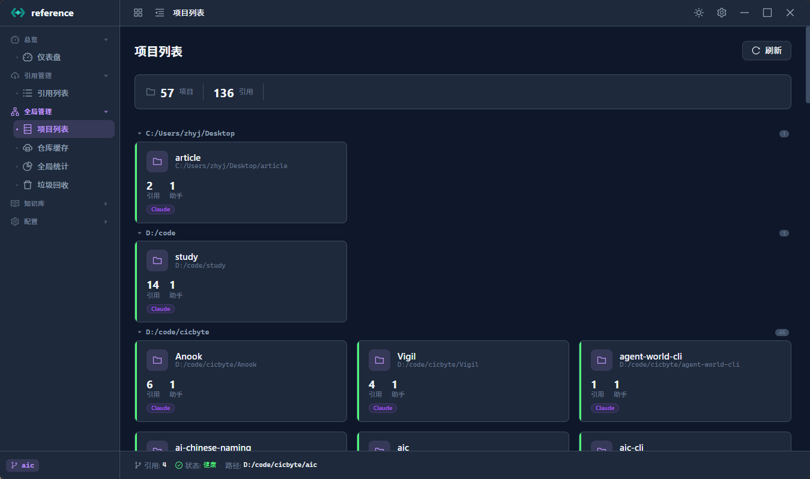
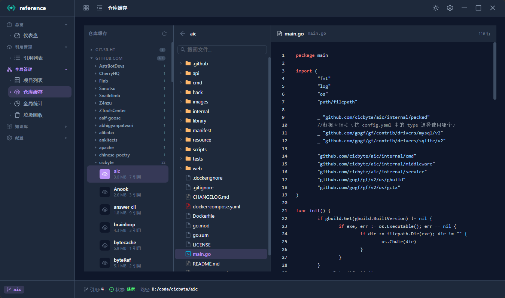
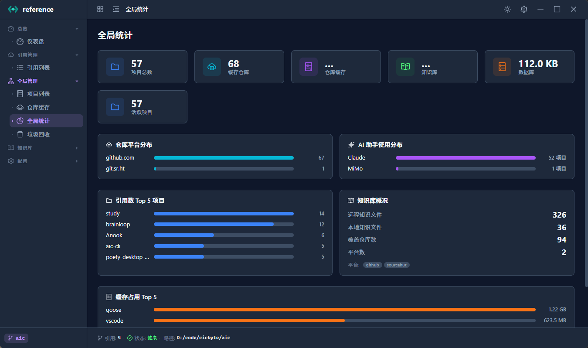
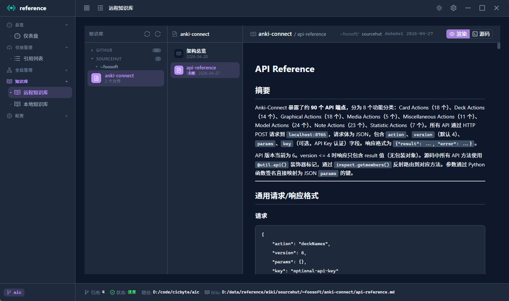
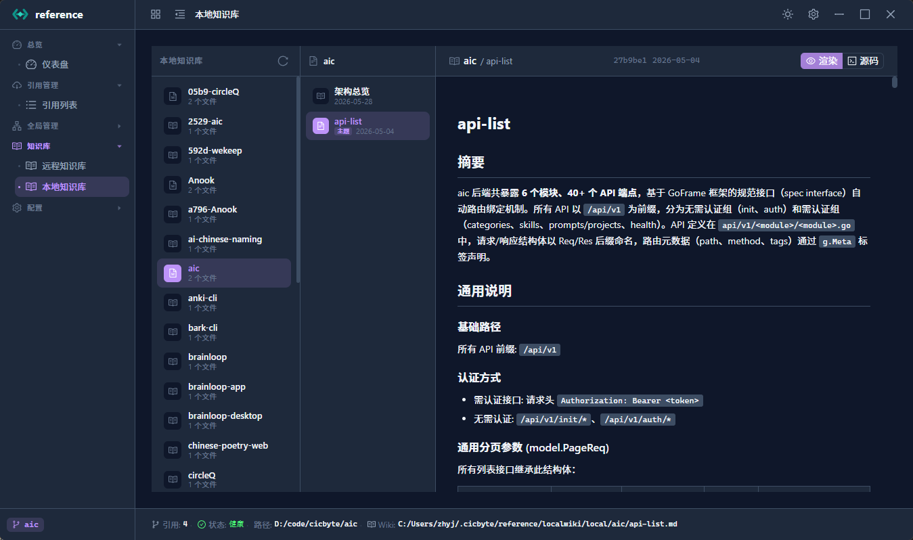
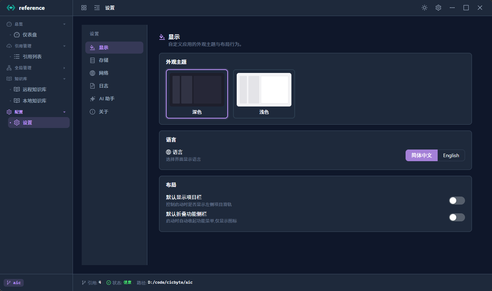

# Reference GUI

[English](README.en.md) | 简体中文

> Reference 的 Wails v2 + Vue 3 桌面客户端 — 可视化管理 Git 仓库引用、知识库与全局诊断。

## 界面预览

### 仪表盘

项目概览：引用仓库数、断裂链接、AI 助手配置、健康状态。



### 项目轨道

左侧项目栏快速切换，支持折叠、右键菜单（切换 / 修复 / 打开 / 移除）。



### 引用管理

管理当前项目引用的仓库，浏览代码、查看统计、诊断修复。



### 项目列表

全局视角查看所有项目，按父目录分组，一键清理失效项目。



### 仓库缓存

按平台/作者分组浏览全局缓存仓库，查看磁盘占用，清除无用缓存。



### 全局统计

多维度数据仪表盘：项目分布、平台分布、AI 助手使用、缓存占用 Top 5。



### 远程知识库

浏览 AI 探索沉淀的知识文件，支持 Markdown 渲染、Mermaid 图表、源码切换。



### 本地知识库

管理本地仓库的探索知识，独立存储，不涉及共享同步。



### 设置

显示主题、语言切换、存储路径、网络代理、日志策略、AI 助手注入。



## 技术栈

| 层 | 技术 |
|:--|:--|
| 桌面框架 | [Wails v2](https://wails.io) (Go 后端 + WebView 前端) |
| 前端 | Vue 3 + TypeScript + Vite |
| UI 组件 | Ant Design Vue 4.x |
| 状态管理 | Pinia |
| 代码高亮 | highlight.js + line-numbers 插件 |
| Markdown | marked + DOMPurify (XSS 防护) |
| 图表 | Mermaid.js (strict 安全模式) |
| 国际化 | vue-i18n (中文 / English) |
| 数据库 | SQLite (glebarez/sqlite, 纯 Go) |

## 构建

```bash
cd gui
wails build
```

开发模式：

```bash
cd gui
wails dev
```

前端依赖：

```bash
cd gui/frontend
npm install
npm run build   # 或 npm run dev（需 wails dev 配合）
```

## 目录结构

```
gui/
├── app.go              # Wails 应用入口、启动初始化
├── binding.go          # 前端绑定的 Go 方法（IPC 接口）
├── main.go             # Wails 配置、窗口、CSP 安全策略
├── diagnose.go         # 交互式诊断修复
├── repo_browser.go     # 代码浏览器（文件树 / 搜索 / 读取）
├── wiki_browser.go     # 知识库浏览器
├── frontend/           # Vue 3 前端
│   └── src/
│       ├── views/      # 页面视图（模块化文件夹）
│       ├── components/  # 共享组件
│       ├── composables/ # 可复用逻辑（useMermaid / useProjectActions）
│       ├── stores/      # Pinia 状态（project / theme / layout / locale）
│       ├── i18n/        # 国际化语言包
│       └── utils/       # 工具函数
└── images/             # README 截图
```

## 功能

- **多项目管理** — 项目轨道快速切换，右键菜单覆盖常用操作
- **引用管理** — 添加/更新/移除仓库引用，内嵌代码浏览器（语法高亮 + 行号 + 搜索）
- **仓库缓存** — 全局视角管理缓存仓库，按平台分组，异步计算磁盘占用
- **知识库** — 浏览 AI 探索的知识文件，Markdown 渲染 + Mermaid 图表缩放/导出
- **全局统计** — 多维度数据仪表盘，纯 CSS 条形图可视化
- **垃圾回收** — 扫描清理失效数据库记录与孤立缓存目录
- **诊断修复** — 交互式逐仓库诊断，针对性修复（重建链接 / 重新克隆 / 重新定位）
- **设置** — 主题 / 语言 / 存储 / 网络 / 日志 / AI 助手，全可视化配置
